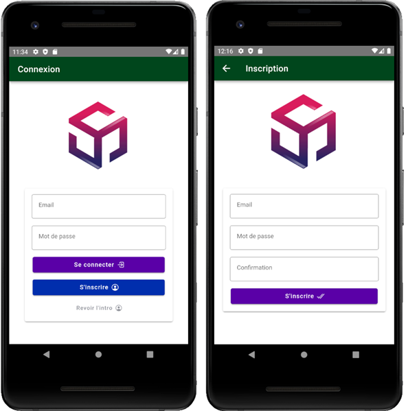

# Introduction

Développement d'une application mobile Android - iOS en Ionic - React - JS - CSS - HTML - SQLite
pour la gestion d'un système de connexion et d'inscription de nouveaux utilisateurs.

# Résumé

